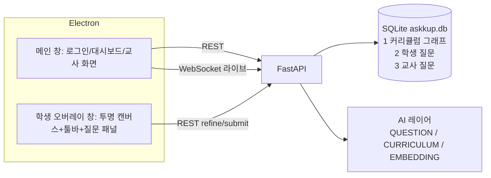

# ASKKUP(질문, 잇다) — Electron 학생/교사 앱 + FastAPI 서버 구현 계획

## Context
학생이 수업 중 원래 화면 위(Grammarly식 투명 오버레이)에 펜/지우개로 표시하고 대충 쓴 텍스트를 보내면, AI가 (펜 표시가 있으면 화면 캡처 포함) 질문을 다듬어 "이 의미가 맞나요?" 예/아니요 확인을 받는다(아니요 → 개선 요청 입력 → 재작성, 예 → 등록). 교사는 실라버스/교안을 올리면 주차 탭과 주차별 주제·개념 그래프가 자동 생성되고(교안 있으면 교안 기반, 없으면 웹 검색 기반) 마인드맵 UI(처음엔 depth 1, 클릭 시 확장)로 편집한다. 교사가 수업을 열면 6자리 코드가 나오고, 학생 질문은 개념별/유형별로 자동 분류되어 교사 라이브 마인드맵(키워드 → 클릭 시 질문 원문)과 시간순 대화창에 실시간 표시된다. 학생은 내 질문을 과목 → 주제/유형 계층으로 본다. 학생/교사 로그인·회원가입 포함.

저장소 현황(확인됨): 코드 없음. `.gitignore`(Python 템플릿, `node_modules/` 없음), 데모 실라버스 `docs/인공지능개론/노해선_인공지능개론01_강의계획서_16주차.pdf`(16주차; 1주차 오리엔테이션, 9주차 중간고사, 14–15주차 기말프로젝트 발표, 16주차 기말고사, 나머지 강의; 매주 "[실습] Orange3를 활용한 머신러닝" 반복; 2페이지는 표 추출이 섞여 나옴), 기획서 `references/질문, 잇다 ASKKUP 해커톤 프로젝트 개요.pdf`. 로컬: Node 22.22, npm 10.9, Python 3.11.7/3.13, uv 0.11.8, Windows x64.

확정된 결정:
- 단일 Electron 앱(로그인 역할로 학생/교사 분기). 서버: Python FastAPI + SQLite.
- LLM 제공자: OpenAI / Gemini / vLLM 모두 지원, **역할별 분리**: `QUESTION`(학생 질문 다듬기·필터, 비전) / `CURRICULUM`(실라버스 파싱, 주차 개념 생성, 질문 개념·유형 분류) + 별도 `EMBEDDING`.
- 개념 분류: 하이브리드(임베딩으로 후보 top-k → LLM이 개념+유형+키워드 최종 결정). 유형은 항상 LLM.
- 포함: 부적절 표현 필터 + 교수자 금지어, 교사 라이브 화면 시간순 대화창(타임스탬프). 제외: 선제 질문 제시. (교수자 수동 재배치는 13절 Shift+드래그로 추가됨.)

## Architecture



질문 등록 흐름: 학생 "예" → `POST /api/questions`가 저장소2(student_questions)에 `pending`으로 **동기** 저장 후 즉시 응답 → 백그라운드 분류 작업이 개념/유형/키워드 결정 → 저장소2 행 갱신 + 저장소3(teacher_questions) upsert(**비동기**, 학생 식별자 컬럼 없음 = 구조적 익명) → 해당 수업 WebSocket 구독자에게 push.

### 디렉터리 레이아웃
```
server/
  pyproject.toml, .env.example
  app/main.py, config.py, db.py, models.py, schemas.py, security.py
  app/routers/{auth,courses,sessions,questions,live}.py
  app/ai/{llm,prompts,structured}.py, app/ai/banned_words_ko.txt
  app/context.py
  app/services/{documents,curriculum,classify,refine,filtering,graph,jobs,live_hub}.py
  tests/{conftest,test_flow,test_regeneration,test_filtering}.py
  data/ (런타임 생성: askkup.db, uploads/syllabus, uploads/materials, uploads/captures)
desktop/  (electron-vite react-ts 템플릿)
  src/main/{index,overlay,profile}.ts
  src/preload/{index.ts,index.d.ts}
  src/renderer/src/{main.tsx,App.tsx,index.css}
  src/renderer/src/api/{client,types}.ts
  src/renderer/src/stores/auth.ts
  src/renderer/src/lib/{trees,questionTypes,format}.ts
  src/renderer/src/components/MindMap/{MindMap,layout,MindNodeView}.tsx|ts
  src/renderer/src/components/{NodeEditorPanel,QuestionFeed,QuestionDetail}.tsx
  src/renderer/src/pages/auth/{LoginPage,SignupPage}.tsx
  src/renderer/src/pages/teacher/{TeacherDashboard,CoursePage,LiveSessionPage}.tsx
  src/renderer/src/pages/student/{StudentDashboard,OverlayPage}.tsx
  src/renderer/src/pages/student/overlay/{strokes,QuestionPanel,Toolbar}.ts|tsx
```

## Approach

### 1. 스캐폴딩
- 루트 `.gitignore` 끝에 추가: `node_modules/`, `desktop/out/`, `server/data/`.
- `server/`: `uv init --app --vcs none --python 3.11 server` 후 생성된 `server/main.py` 삭제, `server/`에서 `uv add fastapi "uvicorn[standard]" "sqlalchemy>=2" aiosqlite pydantic-settings pyjwt "pwdlib[argon2]" python-multipart "openai>=2" google-genai ddgs numpy pymupdf pymupdf4llm python-pptx` 및 `uv add --dev pytest pytest-asyncio httpx`. `pyproject.toml`에 `[tool.pytest.ini_options] asyncio_mode = "auto"`, `pythonpath = ["."]`.
- `desktop/`: 루트에서 `npm create @quick-start/electron@latest desktop -- --template react-ts`(updater/mirror 프롬프트는 No). 이어서 `npm i react-router @xyflow/react d3-hierarchy zustand` 및 `npm i -D @types/d3-hierarchy tailwindcss @tailwindcss/vite`. `electron.vite.config.ts`의 renderer `plugins`에 `tailwindcss()` 추가, `src/renderer/src/index.css` 첫 줄 `@import "tailwindcss";`, 전역 폰트 `font-family: "Malgun Gothic", system-ui, sans-serif`. 템플릿 데모 컴포넌트/에셋(Versions 등) 삭제.

### 2. 서버 코어: 설정·DB·인증
- `app/config.py` `Settings(BaseSettings)`(env_file `.env`, 실행 cwd = `server/`) + `@lru_cache get_settings()`; 모듈 import 시 Settings를 만들지 않음(테스트가 env를 먼저 설정할 수 있게). 필드(그대로의 env 키):
  - `DATA_DIR="./data"`, `JWT_SECRET="dev-secret-change-me"`, `JWT_EXPIRE_DAYS=7`
  - `OPENAI_API_KEY=""`, `GEMINI_API_KEY=""`
  - 역할 `QUESTION`/`CURRICULUM` 각각: `{ROLE}_LLM_PROVIDER`(`openai|gemini|vllm`), `{ROLE}_LLM_MODEL`, `{ROLE}_LLM_BASE_URL`(vllm 필수), `{ROLE}_LLM_API_KEY`(비면 provider별 `OPENAI_API_KEY`/`GEMINI_API_KEY`, vllm은 `"EMPTY"`), `{ROLE}_LLM_REASONING_EFFORT`(빈 값이면 미전송)
  - `QUESTION_LLM_SUPPORTS_IMAGES=true`(false면 캡처를 보내지 않고 프롬프트에 "학생이 화면에 표시했으나 이미지는 제공되지 않음" 문구)
  - `EMBEDDING_PROVIDER`(`openai|gemini|vllm|none`), `EMBEDDING_MODEL`, `EMBEDDING_BASE_URL`, `EMBEDDING_API_KEY`
- `server/.env.example`: OpenAI 기본값 — `QUESTION_LLM_PROVIDER=openai`, `QUESTION_LLM_MODEL=gpt-6-luna`, `QUESTION_LLM_REASONING_EFFORT=low`, `CURRICULUM_LLM_PROVIDER=openai`, `CURRICULUM_LLM_MODEL=gpt-6-luna`, `EMBEDDING_PROVIDER=openai`, `EMBEDDING_MODEL=text-embedding-3-small`; 주석으로 Gemini 예시(`gemini-3.8-flash`, 임베딩 `gemini-embedding-001`), vLLM 예시(`QUESTION_LLM_BASE_URL=http://localhost:8001/v1`, 모델 `Qwen/Qwen2.5-VL-7B-Instruct`, 임베딩 서버 별도 base_url). (gpt-6-luna: Chat Completions·structured outputs·이미지·web_search 지원 확인됨.)
- `app/db.py`: `make_engine(settings)` = `create_async_engine(f"sqlite+aiosqlite:///{DATA_DIR}/askkup.db", connect_args={"timeout": 30})`(lifespan에서 호출, 모듈 전역 엔진 없음); sync engine `connect` 이벤트에서 `PRAGMA journal_mode=WAL`, `PRAGMA foreign_keys=ON`. `async_sessionmaker(expire_on_commit=False)`는 `ctx.sessionmaker`, `get_db(request)` 의존성이 이를 사용. 시간은 naive UTC 저장(`utcnow()` 헬퍼), 응답 직렬화는 `schemas.py`의 `UtcDatetime` Annotated 타입이 `Z` 붙인 ISO로 출력.
- `app/models.py` (SQLAlchemy 2.0 typed ORM). **3개 저장소 = 한 DB 파일의 3개 테이블 그룹**:
  - 계정: `users(id, email unique 소문자, password_hash, name, role 'student'|'teacher', created_at)`
  - 저장소1 커리큘럼 그래프:
    - `courses(id, teacher_id→users, name, code?, semester?, syllabus_filename?, syllabus_status 'none'|'parsing'|'done'|'failed', syllabus_error?, created_at)`
    - `weeks(id, course_id→courses CASCADE, week_no, title, description='', is_lecture=True, gen_status 'idle'|'running'|'done'|'failed', gen_source 'none'|'material'|'web'|'llm', gen_error?)`, `UniqueConstraint(course_id, week_no)`
    - `concept_nodes(id, course_id→courses CASCADE, week_id→weeks CASCADE, parent_id→concept_nodes SET NULL, title, summary='', source 'syllabus'|'material'|'web'|'llm'|'manual', edited=False, position=0, embedding LargeBinary?, embedding_model?)` — 모든 노드가 `week_id`를 가짐(질문의 주차 추적 근거).
    - `materials(id, week_id→weeks CASCADE, filename, stored_path, kind 'pdf'|'pptx', status 'processing'|'done'|'failed', error?, page_count=0, uploaded_at)`
    - `material_chunks(id, material_id→materials CASCADE, week_id→weeks CASCADE, concept_node_id→concept_nodes SET NULL, page_from, page_to, text, embedding?, embedding_model?)`
    - `banned_words(id, course_id→courses CASCADE, word)`, `UniqueConstraint(course_id, word)`
    - `class_sessions(id, course_id→courses CASCADE, week_id→weeks, code, status 'open'|'closed', opened_at, closed_at?)` + partial unique index `Index("uq_open_session_code", "code", unique=True, sqlite_where=text("status = 'open'"))`
  - 저장소2 학생 질문: `student_questions(id, student_id→users, course_id→courses, session_id→class_sessions, session_week_id→weeks, raw_text, capture_path?, refined_text, refine_rounds, status 'pending'|'classified'|'failed', concept_node_id→concept_nodes SET NULL, assigned_week_id→weeks SET NULL, question_type?, keyword?, off_week=False, created_at, classified_at?)`
  - 저장소3 교사 질문(학생 질문의 합집합, 학생 식별자 없음): `teacher_questions(id, student_question_id→student_questions CASCADE unique, course_id, session_id, assigned_week_id→weeks, concept_node_id→concept_nodes SET NULL, question_type?, keyword, refined_text, off_week, created_at, classified_at)`
- 유형 enum(`schemas.QuestionType(str, Enum)`, 와이어 값 고정): `info_seeking`=정보 수집형, `info_expanding`=정보 확장형, `application_expanding`=적용 확장형, `connecting`=연결형, `reflective`=반성적·성찰적.
- `app/security.py`: `PasswordHash.recommended()`(pwdlib), `create_token(user)`(HS256, `sub`=str(id), `role`, `exp`), 의존성 `current_user`(Bearer), `require_teacher`, `require_student`(역할 불일치 403 `"권한이 없습니다"`). WebSocket용 `user_from_token(token)`.
- `app/routers/auth.py`:
  - `POST /api/auth/signup {email, password(min 8), name, role}` → 201 `{token, user}`; 중복 이메일 409 `"이미 가입된 이메일입니다"`.
  - `POST /api/auth/login {email, password}` → `{token, user}`; 실패 401 `"이메일 또는 비밀번호가 올바르지 않습니다"`.
  - `GET /api/auth/me` → `UserOut{id,email,name,role}`.
- `app/context.py` `@dataclass AppContext(settings: Settings, sessionmaker, ai: AIClients, hub: LiveHub, jobs: JobRunner)`. 모든 백그라운드 작업 시그니처는 `async def xxx_job(ctx: AppContext, <id>: int)`; 라우터는 `request.app.state.ctx`(WebSocket은 `websocket.app.state.ctx`)로 접근. 테스트는 lifespan 시작 후 `app.state.ctx.ai`를 가짜로 교체.
- `app/main.py`: `lifespan`에서 `DATA_DIR/uploads/{syllabus,materials,captures}` 생성, `Base.metadata.create_all`, `app.state.ctx = AppContext(settings, sessionmaker, build_ai_clients(settings), LiveHub(), JobRunner())`; 복구: `courses.syllabus_status='parsing'`→`failed`(error `"서버 재시작으로 중단됨"`), `weeks.gen_status='running'`→`failed`(같은 메시지), `student_questions.status='pending'` 전부 분류 작업 재등록. `CORSMiddleware(allow_origins=["*"], allow_methods=["*"], allow_headers=["*"])`(Bearer 토큰만 사용, 쿠키 없음 — Electron prod는 `file://` origin `null`). 실행: `uv run uvicorn app.main:app --host 0.0.0.0 --port 8000`.
- `app/services/jobs.py` `JobRunner`: `spawn(coro)`(강참조 set 보관, 예외 로깅), `lock(key) -> asyncio.Lock`(키별), 세마포어 `generation_sem=Semaphore(3)`, `classify_sem=Semaphore(4)`, `async drain()`(남은 태스크가 0이 될 때까지 반복 gather — 작업이 작업을 낳으므로 루프; 테스트 대기용). 각 작업은 `ctx.sessionmaker()`로 자체 DB 세션을 연다.

### 3. AI 레이어 (`app/ai/llm.py`, `app/ai/prompts.py`)
신규 코드(기존 없음). 세 제공자 모두 **OpenAI Python SDK `AsyncOpenAI` + base_url**로 채팅/비전/구조화 출력/임베딩을 단일 경로로 처리(Gemini는 `https://generativelanguage.googleapis.com/v1beta/openai/` — 이미지·structured output(`parse`)·임베딩 지원 확인됨; vLLM은 OpenAI 호환 서버). 웹 검색만 제공자별.
- `class ChatModel`: `__init__(provider, model, base_url, api_key, reasoning_effort)`.
  - `async def json(self, system: str, content: str | list[dict], schema: type[T]) -> T`: `client.chat.completions.parse(model=…, messages=[system, user], response_format=schema, **({"reasoning_effort": e} if e else {}))` → `message.parsed`. `parsed is None`면 `message.content`에서 ```` ``` ```` 펜스 제거 후 `schema.model_validate_json`. 실패 시 1회 재시도 후 예외. `temperature`는 보내지 않음(최신 추론 모델 거부).
  - 이미지 첨부는 content 파트 `{"type":"image_url","image_url":{"url": data_url}}`.
  - `async def research(self, prompt: str, query: str) -> str | None`:
    - `openai`: `client.responses.create(model, tools=[{"type":"web_search"}], input=prompt)` → `output_text`
    - `gemini`: `google.genai.Client(api_key).aio.models.generate_content(model, contents=prompt, config=types.GenerateContentConfig(tools=[types.Tool(google_search=types.GoogleSearch())]))` → `.text`
    - `vllm`: `await asyncio.to_thread(lambda: DDGS().text(query, region="kr-kr", max_results=6))` → `"- {title}: {body} ({href})"` 줄 결합
    - 모든 예외 → 로깅 후 `None`.
- `class Embedder`: 속성 `model: str`; `async def embed(texts: list[str]) -> list[np.ndarray]` — 64개씩 배치 `client.embeddings.create`, float32, L2 정규화. `EMBEDDING_PROVIDER=none`이면 `build_ai_clients`가 `embedder=None`.
- `@dataclass AIClients(question: ChatModel, curriculum: ChatModel, embedder: Embedder | None)`, `build_ai_clients(settings)`(vllm인데 base_url 없으면 시작 시 `ValueError`).
- 모든 구조화 스키마는 `app/ai/structured.py`의 `ConfigDict(extra="forbid")` pydantic 모델(필드 기본값 없음, nullable은 `X | None`):
  - `RefineResult{appropriate: bool, block_reason: str, refined_question: str}`
  - `SyllabusParse{weeks: list[SyllabusWeek]}`, `SyllabusWeek{week_no: int, title: str, topics: list[str], is_lecture: bool, description: str}`
  - `WeekConcepts{topics: list[GenTopic]}`, `GenTopic{existing_topic_id: int | None, title: str, summary: str, concepts: list[GenConcept]}`, `GenConcept{title: str, summary: str, chunk_ids: list[int]}`
  - `ClassifyResult{concept_node_id: int | None, question_type: QuestionType, keyword: str}`
- `prompts.py`(한국어, 상수 문자열):
  - `REFINE_SYSTEM`: 대학 강의 조교 역할; 학생의 단어 위주/비문/오탈자 입력과(있으면) 빨간 펜 표시 캡처를 보고 **원래 의도를 유지**하며 교수자가 정확히 이해·답변할 수 있는 존댓말 의문문 1~2문장으로 재작성; 기준 명확성·구체성·맥락 적합성(현재 주차 주제)·의도 충실성(묻지 않은 내용 추가 금지); 질문에 답하지 말 것; 이전 다듬은 질문+수정 요청이 있으면 요청 반영; 욕설·비속어·인신공격 또는 수업과 명백히 무관(예: "점심 뭐 먹지")하면 `appropriate=false`와 한국어 `block_reason`, 학습 관련이면 애매해도 true.
  - `SYLLABUS_SYSTEM`: 강의계획서 텍스트에서 모든 주차 추출; `title`=해당 주차 핵심 개념/주제명(예 "지도학습"), `topics`=세부 강의 항목(앞의 `-` 제거, `[실습]` 항목은 topics에서 제외하고 `description`에 포함), 오리엔테이션·중간/기말고사·발표·휴강 주차는 `is_lecture=false`; 표 열 순서가 섞여 있어도 주차 번호 기준으로 복원.
  - `WEEK_FROM_MATERIAL_SYSTEM` / `WEEK_FROM_WEB_SYSTEM`: 주차 주제를 3~6개 상위 주제 × 각 2~6개 개념으로 분해, 기존 실라버스 주제와 같으면 `existing_topic_id`에 그 id, 각 개념 `summary` 1문장, 교안 모드는 근거 청크 id를 `chunk_ids`에(웹 모드는 빈 배열).
  - `WEB_RESEARCH_PROMPT`: "{course} 강의 {week_no}주차 '{week_title}'(세부: {topics}) 대학 입문 수준에서 다루는 핵심 개념과 하위 개념을 조사해 목록으로 정리".
  - `CLASSIFY_SYSTEM`: 후보 개념 중 1개(없으면 null) + 5개 유형 중 1개 + 2~12자 핵심 키워드 명사구; 유형 정의는 다음 그대로 포함 — 정보 수집형: 기본 사실 정보, 특정 개념·사실·정보 등 일반적 내용 탐색 / 정보 확장형: 문제 영역에 따른 지식 적용 탐구, 추가 정보·설명·예시 요청 / 적용 확장형: 문제 상황을 명확히 인식해 자신의 관점에 맞게 활용, 본인 관점의 문제해결을 위한 탐색적 질문 / 연결형: 두 개 이상의 개념을 연결 / 반성적·성찰적: 평가적·비판적 사고 유도, 의사결정이나 사고방식 변화; "현재 수업은 {N}주차 — 현재 주차 개념과 관련되면 현재 주차 개념을 우선, 다른 주차 개념과 명백히 더 관련될 때만 다른 주차 선택".

### 4. 커리큘럼 그래프 파이프라인 (저장소1)
- `app/services/documents.py`:
  - `extract_pdf_markdown(path) -> str`: `pymupdf4llm.to_markdown(path)`(실라버스용, 30,000자 컷).
  - `extract_chunks(path, kind) -> list[ChunkDraft(page_from, page_to, text)]`: PDF는 `pymupdf4llm.to_markdown(path, page_chunks=True)`를 `enumerate(..., 1)`로 페이지 번호 부여(메타데이터 키에 의존하지 않음); PPTX는 `python-pptx`로 슬라이드별 text_frame·표 셀·노트 텍스트. 20자 미만 페이지 버림, 1,500자 초과 페이지는 빈 줄 기준으로 ~1,000자 조각 분할. 동기 함수 → 호출부에서 `asyncio.to_thread`.
- `app/services/graph.py`:
  - `node_embedding_text(node, parent, week) = f"{week.week_no}주차 {week.title} > {parent.title + ' > ' if parent else ''}{node.title}: {node.summary}"`.
  - `ensure_embeddings(db, ai, course_id)`: `ai.embedder`가 있으면 embedding이 null이거나 `embedding_model != ai.embedder.model`인 노드·청크를 배치 임베딩해 저장(`np.float32.tobytes()`, `embedding_model=ai.embedder.model`). 노드 생성/제목·요약 수정/이동 시 해당 노드(이동 시 서브트리) `embedding=None`. 분류 시 유사도 계산은 `embedding_model == ai.embedder.model`인 행만 사용.
  - `concept_path(nodes_by_id, node_id) -> list[{id,title}]`(루트→리프).
  - `delete_subtree(db, node)`: 서브트리 노드 삭제; 이 노드들에 붙은 저장소2·3 질문의 `concept_node_id`를 삭제 노드의 부모 id(없으면 null)로 갱신.
- `app/services/curriculum.py`:
  - `parse_syllabus_job(course_id)`: 마크다운 추출 → `curriculum.json(SyllabusParse)` → 기존 weeks 전부 삭제 후 week 생성 + 각 `topics`를 `source='syllabus'` 최상위 노드로 생성 → `syllabus_status='done'` → `is_lecture`이고 `status='done'` 교안이 없는 주차마다 `generate_week_job` spawn. 예외 시 `failed` + `syllabus_error=str(e)[:500]`.
  - `generate_week_job(week_id)`: `async with jobs.lock(f"week:{id}")` + `generation_sem`. `gen_status='running'` 커밋 → 공통 입력: 강좌명, `{week_no}주차 {title}`, `description`, 기존 실라버스 주제를 `[topic:{id}] {title}` 줄로 →
    - 교안 모드(`status='done'` 교안 존재): 주차 청크를 `[chunk:{id}] (p.{from}-{to}) 앞 600자` 줄로, 총 24,000자 컷; `WEEK_FROM_MATERIAL_SYSTEM`; `gen_source='material'`.
    - 웹 모드: `curriculum.research(WEB_RESEARCH_PROMPT, query=f"{course.name} {week.title}")` → 노트가 있으면 `WEEK_FROM_WEB_SYSTEM` 입력에 포함하고 `gen_source='web'`, `None`이면 노트 없이 `gen_source='llm'`.
    - 적용: 삭제집합 D = 이 주차의 `source in ('material','web','llm') and edited=False` 노드. D에 속하지 않는 노드의 부모가 D면 D 밖의 가장 가까운 조상(없으면 null)으로 재부모화. D 노드에 붙은 질문 id 수집 → D 삭제(청크 FK는 SET NULL). `GenTopic.existing_topic_id`가 이 주차의 `source='syllabus'` 노드면 그 아래에, 아니면 새 최상위 노드(source=gen_source)로 생성; 기존 주제 `summary`가 비었으면 채움. 개념 노드 생성, `chunk_ids` 중 이 주차 청크만 `concept_node_id` 연결. position = 형제 최대+1.
    - `gen_status='done'` → `ensure_embeddings` → 수집된 질문은 `status='pending'`, `concept_node_id=None`으로 바꾸고 분류 작업 재등록.
    - `ensure_embeddings` 예외는 로깅만 하고 주차 생성은 `done` 유지(분류 단계가 LLM 전용 후보로 폴백).
    - 예외: `gen_status='failed'`, `gen_error=str(e)[:500]`.
  - `process_material_job(material_id)`: `extract_chunks` → 청크 저장(`page_count` 갱신) → `ensure_embeddings` → `status='done'` → `generate_week_job`. 추출 실패 시 `status='failed'`, `error`.
- `app/routers/courses.py`(모두 `require_teacher`, 남의 강좌는 404 `"강의를 찾을 수 없습니다"`):
  - `GET /api/courses` → `CourseSummary[]{id,name,code,semester,week_count,question_count,open_session: SessionOut|null}`; `POST /api/courses {name, code?, semester?}`; `PATCH /api/courses/{id}`; `DELETE /api/courses/{id}`(student_questions가 있으면 409 `"질문이 있는 강의는 삭제할 수 없습니다"`).
  - `POST /api/courses/{id}/syllabus`(multipart `file`, `.pdf`만, ≤50MB; 아니면 400 `"PDF 파일만 업로드할 수 있습니다"`): 해당 강좌에 student_questions가 하나라도 있으면 409 `"질문이 있는 강의는 실라버스를 다시 올릴 수 없습니다"`. 파일을 `uploads/syllabus/{course_id}_{uuid}.pdf`로 저장, `parsing` 설정, `parse_syllabus_job` spawn, 202.
  - `GET /api/courses/{id}/graph` → `GraphOut{course, weeks: WeekOut[], open_session}`; `WeekOut{id, week_no, title, description, is_lecture, gen_status, gen_source, gen_error, materials: MaterialOut[]{id,filename,kind,status,error,page_count}, nodes: NodeOut[]{id,parent_id,title,summary,source,edited,position,question_count}}`(question_count = 저장소3에서 그 노드에 직접 붙은 수).
  - `POST /api/courses/{id}/weeks {title}`(week_no = 최대+1, is_lecture=True); `PATCH /api/weeks/{id} {title?, is_lecture?}`; `DELETE /api/weeks/{id}`(질문/수업이 참조하면 409 `"질문 또는 수업 기록이 있는 주차는 삭제할 수 없습니다"`); `POST /api/weeks/{id}/regenerate` → `generate_week_job` spawn, 202(`running`이면 409 `"이미 생성 중입니다"`).
  - `POST /api/weeks/{id}/materials`(multipart `file`, `.pdf|.pptx`, ≤50MB) → `uploads/materials/{week_id}_{uuid}.{ext}` 저장, `process_material_job`; `DELETE /api/materials/{id}` → 파일·청크 삭제 후 `generate_week_job`.
  - `POST /api/weeks/{id}/nodes {parent_id?, title, summary?}`(source='manual', edited=True); `PATCH /api/nodes/{id} {title?, summary?, parent_id?, week_id?}`(edited=True; parent는 같은 주차여야 하고 자기 자신/후손이면 400 `"자기 하위 노드로 이동할 수 없습니다"`; week_id 변경 시 서브트리 week_id 일괄 변경, parent는 null로); `DELETE /api/nodes/{id}` → `delete_subtree`.
  - `GET|POST /api/courses/{id}/banned-words`(`{word}`, 공백 제거·소문자 저장, 중복 409), `DELETE /api/banned-words/{id}`.
  - `GET /api/courses/{id}/questions` → 이 강좌 저장소3 `TeacherQuestionOut[]`.

### 5. 수업 세션 + 실시간 허브
- `app/routers/sessions.py`:
  - `POST /api/courses/{id}/sessions {week_id}`(teacher): 이 강좌에 open 세션이 있으면 그것을 200으로 반환; 아니면 코드 생성(`secrets.choice("ABCDEFGHJKLMNPQRSTUVWXYZ23456789")` 6자, open 세션과 충돌 시 재생성) → 201 `SessionOut{id, course_id, course_name, week_id, week_no, week_title, code, status, opened_at, closed_at}`.
  - `POST /api/sessions/{id}/close`(teacher) → closed + hub publish `{"type":"session.closed"}`.
  - `GET /api/sessions/{id}`(teacher) → `SessionOut`; `GET /api/sessions/{id}/questions`(teacher) → 그 세션 `TeacherQuestionOut[]` created_at 오름차순.
  - `POST /api/sessions/join {code}`(student): `strip().upper()`, open 세션 없으면 404 `"유효하지 않거나 종료된 수업 코드입니다"` → `SessionOut`.
- `app/services/live_hub.py` `LiveHub`: `subscribe(session_id, ws)`, `unsubscribe`, `publish(session_id, message: dict)`(전송 실패 소켓 제거).
- `app/routers/live.py` `WS /ws/sessions/{session_id}?token=…`: 토큰 사용자가 그 세션 강좌의 교사가 아니면 `close(code=4403)`; accept → subscribe → `receive_text()` 루프(클라이언트 ping 무시) → 끊기면 unsubscribe. 메시지: `{"type":"question.created","question":TeacherQuestionOut}`, `{"type":"question.updated","question":TeacherQuestionOut}`, `{"type":"session.closed"}`.
- `TeacherQuestionOut{id, session_id, session_week_no, assigned_week: {id, week_no, title}, concept_path: [{id,title}], question_type: QuestionType|null, keyword, refined_text, off_week, created_at, classified_at}` — 학생 id/이름/raw_text 필드 없음.

### 6. 학생 질문: 필터 → 다듬기 → 등록 → 하이브리드 분류
- `app/ai/banned_words_ko.txt`(한 줄 한 단어): `씨발, 시발, ㅅㅂ, ㅆㅂ, 병신, ㅂㅅ, 개새끼, 좆, 존나, ㅈㄴ, 지랄, 닥쳐, 꺼져, 등신, 썅, 엿먹어, 미친놈, 미친년, fuck, shit, bitch`.
- `app/services/filtering.py`: `normalize(s)` = 소문자 + 한글/영문/숫자/자모 외 문자 및 공백 제거; `ALLOWLIST = ("시발점", "시발역")`을 정규화 문자열에서 먼저 제거; `find_banned(text, course_words) -> str | None`(남은 문자열에 정규화 단어가 부분 포함되면 그 단어 반환). 내장 목록은 모듈 로드 시 파일에서 1회 읽음.
- `app/services/refine.py` `refine_question(db, ai, session, raw_text, image, previous_refined, feedback) -> RefineOut`:
  1. `raw_text`/`feedback`에 `find_banned` 적중 → `{status:"blocked", reason:"부적절한 표현('{word}')이 포함되어 있어요. 수정 후 다시 시도해 주세요."}`(LLM 호출 없음).
  2. 컨텍스트: 강좌명, 세션 주차 번호·제목, 그 주차 노드 제목(상위 > 하위)들.
  3. `ai.question.json(REFINE_SYSTEM, content, RefineResult)`; content = 텍스트(강의/주차/주제/학생 입력(없으면 "(텍스트 없음 – 화면 표시만 있음)")/이전 다듬은 질문/수정 요청) + `QUESTION_LLM_SUPPORTS_IMAGES`면 이미지 파트.
  4. `appropriate=false` → `{status:"blocked", reason: block_reason}`; 아니면 `{status:"ok", refined_text}`.
- `app/routers/questions.py`:
  - `POST /api/questions/refine`(student) `{session_id, raw_text, image: data_url|null, previous_refined: str|null, feedback: str|null}` → `RefineOut{status:"ok"|"blocked", refined_text: str|null, reason: str|null}`. `raw_text.strip()`와 image 둘 다 없으면 422 `"질문 내용이나 펜 표시가 필요합니다"`; 세션 closed면 409 `"수업이 종료되어 질문을 등록할 수 없습니다"`; image는 `data:image/jpeg;base64,`만 허용, 디코드 ≤5MB(아니면 400). LLM 예외 → 502 `"AI 응답에 실패했습니다. 잠시 후 다시 시도해 주세요"`.
  - `POST /api/questions`(student) `{session_id, raw_text, image|null, refined_text, refine_rounds}`: 세션 open 확인(409 동일 문구), `refined_text`에 `find_banned` 재검사(적중 시 400 `"부적절한 표현이 포함되어 있습니다"`), 이미지는 `uploads/captures/{uuid}.jpg` 저장 → 저장소2 행 `status='pending'`, `course_id`/`session_week_id`는 세션에서 → commit → `jobs.spawn(classify_question_job(id))` → 201 `StudentQuestionOut`.
  - `GET /api/me/questions`(student) → `StudentQuestionOut[]{id, course: {id,name}, session_week: {id,week_no,title}, assigned_week: {id,week_no,title}|null, concept_path, question_type, keyword, status, raw_text, refined_text, has_capture, off_week, created_at}` 최신순.
  - `GET /api/questions/{id}/capture`(소유 학생만, 아니면 404) → `FileResponse(media_type="image/jpeg")`.
- `app/services/classify.py` `classify_question_job(question_id)` (`classify_sem` 하에):
  1. 질문·세션 주차 로드, 강좌 전체 노드 로드, `ensure_embeddings`.
  2. 후보: `embedder`가 있고 노드 임베딩이 모두 있으면 → `q = embed([refined_text])[0]`; `score[node] = q·node_emb`; 청크(`concept_node_id` 있음)마다 `score[chunk.node] = max(score, q·chunk_emb)`(교안이 있으면 후보 품질 향상); 후보 = 세션 주차 노드 전체(id 오름차순) 다음에 나머지 중 점수 상위 8개(점수 내림차순), 최대 24개. 임베딩 불가(embedder 없음/예외)면 후보 = 세션 주차 노드(id 오름차순) 다음 나머지 강좌 노드(주차·id 순), 최대 150.
  3. `ai.curriculum.json(CLASSIFY_SYSTEM, …, ClassifyResult)`; 후보 줄 형식 `[id] {week_no}주차 · {경로 ' > '} — {summary 앞 80자}`(하이브리드면 ` (유사도 0.xx)` 추가). 후보가 0개(강좌에 노드 없음)면 "후보 개념 없음 — concept_node_id는 null"로 보내 유형·키워드만 받음. 응답 `concept_node_id`가 후보 밖이면 null. 예외/무효면 1회 재시도.
  4. 성공: `assigned_week_id = node.week_id`(null이면 세션 주차), `off_week = assigned_week_id != session_week_id`, 저장소2 `status='classified'` + 필드 갱신, 저장소3 `student_question_id`로 upsert(같은 트랜잭션) → 기존 행 없었으면 `question.created`, 있었으면 `question.updated` publish.
  5. 최종 실패: 저장소2 `status='failed'`, 저장소3 upsert(`concept_node_id=None`, `question_type=None`, `keyword=refined_text[:12]`, 세션 주차) 후 publish → 교사 화면 "미분류"에 표시.

### 7. Electron 메인/프리로드 (오버레이·캡처·프로필)
- `src/main/profile.ts`: `process.argv`의 `--profile=<name>`이 있으면 `app.setPath('userData', join(app.getPath('appData'), `askkup-${name}`))`를 `app.whenReady()` 전에 실행(한 PC에서 교사/학생 동시 로그인 시 localStorage 분리).
- `src/main/index.ts`: 메인 창 1280×800, `#/login` 로드(dev `ELECTRON_RENDERER_URL + '#/login'`, prod `loadFile(renderer index.html, { hash: '/login' })`). 템플릿의 `window-all-closed` → quit 유지.
- `src/main/overlay.ts`:
  - `overlay:open(params: {sessionId, courseName, weekNo, weekTitle})`: 기존 오버레이 있으면 파괴 후 재생성. `display = screen.getDisplayNearestPoint(screen.getCursorScreenPoint())`; `new BrowserWindow({...display.bounds, transparent:true, frame:false, resizable:false, movable:false, skipTaskbar:true, hasShadow:false, alwaysOnTop:true, fullscreenable:false, backgroundColor:'#00000000', webPreferences:{preload, sandbox:false}})`; `setAlwaysOnTop(true,'screen-saver')`; `setIgnoreMouseEvents(true,{forward:true})`; 해시 `/overlay?sessionId=…&courseName=…&weekNo=…&weekTitle=…`(encodeURIComponent) 로드; 메인 창 `hide()`.
  - `overlay:set-interactive(v)`(send): `setIgnoreMouseEvents(!v, {forward:true})`, 마지막 값 기억.
  - `overlay:capture`(invoke): `overlay.hide()` → 200ms 대기 → `desktopCapturer.getSources({types:['screen'], thumbnailSize:{width: round(bounds.width*scaleFactor), height: round(bounds.height*scaleFactor)}})` → `display_id === String(display.id)`인 소스(없으면 첫 소스) → `thumbnail.toJPEG(90)` base64 data URL → `finally`에서 `overlay.show()`, `setAlwaysOnTop(true,'screen-saver')`, 기억한 interactive 상태 재적용.
  - `overlay:close`: 오버레이 파괴, 메인 창 `show()`, 메인에 `overlay:closed` 이벤트 전송. `main:show`: 메인 창 `show()+focus()`.
- `src/preload/index.ts`: `contextBridge.exposeInMainWorld('askkup', { openOverlay, closeOverlay, setOverlayInteractive, captureScreen, showDashboard, onOverlayClosed(cb) => unsubscribe })`; `index.d.ts`에 `window.askkup` 타입 선언.

### 8. 렌더러 기반: 라우팅·API·인증 화면
- `main.tsx`: `HashRouter`(react-router v7). 라우트: `/login`, `/signup`, `/teacher`, `/teacher/courses/:courseId`, `/teacher/sessions/:sessionId/live`, `/student`, `/overlay`. 가드: 토큰 없으면 `/login`; 역할 불일치 시 역할 홈(`/teacher`|`/student`)으로.
- `stores/auth.ts`(zustand `persist`, key `askkup-auth`): `{serverUrl (기본 import.meta.env.VITE_API_BASE_URL ?? 'http://localhost:8000'), token, user, setServerUrl, login(token,user), logout()}`. 오버레이 창은 같은 origin이라 localStorage 공유.
- `api/client.ts`: `api<T>(path, {method, json, form})` — `serverUrl` + Bearer, 비 2xx면 `ApiError(status, detail)`(FastAPI `detail` 문자열 그대로 사용자 표시), 401이면 `logout()` 후 `/login`. `wsUrl(path)` = serverUrl의 `http`→`ws`. `api/types.ts`는 2·4·5·6단계 스키마를 그대로 미러.
- `LoginPage`: 이메일·비밀번호·접힌 "서버 주소" 입력(기본값 표시) → 로그인 → 역할 홈. `SignupPage`: 이름·이메일·비밀번호(8자+)·역할 라디오(학생/교사) → 가입 즉시 로그인.

### 9. MindMap 컴포넌트 (교사 편집·교사 라이브·학생 대시보드 공용)
- `type MindNode = { id: string; label: string; kind: 'root'|'week'|'topic'|'concept'|'type'|'group'|'question'; count?: number; detail?: string; badge?: string; children: MindNode[] }`. id 규칙(데이터 갱신에도 안정): `course-{id}`, `week-{id}`, `node-{id}`, `type-{code}`, `group-{name}`, `q-{id}`.
- `MindMap({ root, selectedId?, onSelect?, height })`:
  - 상태 `expanded: Set<string>` 초기값 `{root.id}` → **루트와 직속 자식만 표시(max-depth=1)**. 자식 있는 노드 클릭 → expanded 토글 + `onSelect`. `question` 노드 클릭 → `openQuestions` 토글: 닫힘=`label`(키워드), 열림=`detail`(질문 원문) 박스.
  - `layout.ts`: 확장 상태로 잘라낸 가시 트리에 `d3-hierarchy` `tree().nodeSize([1, 280]).separation((a,b) => (h(a)+h(b))/2 + 16)`(nodeSize 1이라 separation이 곧 px; `h` = 열린 질문은 `40 + 18*min(8, ceil(len/22))`, 그 외 40) → 가로형(`x↔y` 교체, 루트 왼쪽).
  - `@xyflow/react` 렌더: 커스텀 노드 `MindNodeView`(왼쪽 target/오른쪽 source `Handle`, kind별 색: week indigo, topic sky, concept emerald, type은 `questionTypes.ts` 색, group gray, question 흰 카드+amber 테두리, `count` 배지, `badge` 텍스트 태그, 자식이 있고 접혀 있으면 `+n` 표시), 엣지 `smoothstep`. `nodesDraggable={false}`, `nodesConnectable={false}`. `fitView({padding:0.2,duration:300})`는 첫 렌더와 expanded 변경 시에만(실시간 데이터 추가 시엔 하지 않음).
- `lib/trees.ts` 빌더(모두 count = 서브트리 질문 수):
  - `buildCourseTree(graph, questions?)`: `강좌명` → `{n}주차 · {title}`(비강의 주차 badge "수업 없음") → 최상위 노드 → 하위 노드; `questions` 주어지면 각 질문을 `q-{id}`(label=keyword, detail=refined_text, badge=off_week면 `"{session_week_no}주차 수업에서"`)로 `concept_node_id` 노드 아래(없으면 주차 아래) 추가.
  - `buildWeekTree(graph, weekId, questions?)`: 위와 같되 루트 = 해당 주차.
  - `buildLiveConceptTree(session, questions)`: 루트 `{week_no}주차 · {week_title}`; `assigned_week.id == session.week_id`면 `concept_path`를 따라 루트 아래 삽입(path 비면 `group-unclassified` "미분류"); 아니면 `group-other-weeks` "다른 주차" → `week-{id}` → path → 질문(badge `"→ {n}주차"`). 질문 노드만 있는 개념만 생성.
  - `buildTypeTree(rootLabel, questions)`: 5개 유형 노드 항상 표시(count 0 포함) + `question_type == null`이면 "미분류" → 질문.
  - `buildStudentTree(course, questions, mode: 'concept'|'type')`: concept = 강좌 → `assigned_week`(pending은 "분류 중" 그룹) → `concept_path` → 질문; type = `buildTypeTree` 동일 규칙(+"분류 중").

### 10. 교사 화면
- `TeacherDashboard`: 강좌 카드 그리드(이름·학수번호·학기·주차 수·질문 수·"수업 중" 배지) + "새 강의" 모달(강의명 필수, 학수번호/학기 선택) → 생성 후 `CoursePage`로.
- `CoursePage`:
  - 헤더: 강좌명, `수업 열기` 모달(주차 select, 기본값 = 마지막 세션 주차보다 큰 첫 강의 주차, 세션 이력 없으면 첫 강의 주차) → `POST sessions` → `LiveSessionPage`로. 주차가 0개면 버튼 비활성 + 툴팁 "주차를 먼저 만들어 주세요". open 세션이 있으면 버튼이 `진행 중인 수업 보기 (코드 XXXXXX)`.
  - 실라버스 카드: `none`이면 PDF 업로드 드롭존, `parsing`이면 스피너 "실라버스 분석 중…", `failed`면 `syllabus_error` + 재업로드, `done`이면 파일명 + 재업로드(409 문구 표시).
  - 탭: `전체` + `{n}주차`… + `+ 주차 추가`. 폴링: `parsing`/`running`/교안 `processing`이 하나라도 있으면 2초마다 `GET graph`.
  - `전체` 탭: `MindMap(buildCourseTree)`. 주차 탭: 제목 인라인 편집, `수업 주차` 토글(is_lecture), 생성 상태 배지(`교안 기반`/`웹 검색 기반`/`AI 생성(검색 실패)`/`생성 중…`/`실패: {gen_error}`), `다시 생성` 버튼, 교안 목록(파일명·상태·삭제) + `교안 업로드`(.pdf/.pptx, 여러 번 가능), `질문 보기` 토글(켜면 `GET /api/courses/{id}/questions`로 질문 리프 추가), `MindMap(buildWeekTree)`.
  - `NodeEditorPanel`(오른쪽, MindMap `onSelect` 대상): week 노드 → 제목/수업 주차/다시 생성/주차 삭제; topic·concept 노드 → 제목·요약 입력 + `저장`(PATCH), `하위 개념 추가`(POST, parent=선택 노드), `삭제`(confirm "하위 개념도 함께 삭제됩니다"), `이동`: 주차 select + 부모 select(그 주차 노드들 + "주차 최상위"); 주차 루트 선택 시 `주제 추가`(parent 없음); question 노드 → 읽기 전용(텍스트·유형·주차). 모든 변경 후 graph 재조회.
  - 금지어 카드: 칩 목록(×로 삭제) + 입력·추가.
- `LiveSessionPage`:
  - 초기 `GET /api/sessions/{id}` + `GET /api/sessions/{id}/questions`; WebSocket `wsUrl('/ws/sessions/{id}?token=…')` 연결, `question.created`는 추가·`question.updated`는 id로 교체, `session.closed`면 종료 배너. 끊기면 2초 후 재연결 + questions 재조회로 동기화.
  - 헤더: `{course} · {n}주차 {title}`, 큰 글씨 수업 코드, `수업 종료`(confirm → close → CoursePage).
  - 좌측(2/3): `개념별 | 유형별` 토글 → `MindMap(buildLiveConceptTree | buildTypeTree('질문 유형'))`. 우측(1/3) `QuestionFeed`: 시간순(오래된 것 위, 새 항목 시 하단 자동 스크롤), 항목 = `HH:mm:ss` + 유형 배지 + 키워드 + 질문 원문 + off_week면 `→ {n}주차` 배지.

### 11. 학생 화면
- `StudentDashboard`:
  - `수업 참여` 카드: 6자 코드 입력(자동 대문자) → `POST /api/sessions/join` → `window.askkup.openOverlay({sessionId, courseName, weekNo, weekTitle})`.
  - `내 질문`: `GET /api/me/questions`, 강좌 탭(질문의 course 기준), `주제별 | 유형별` 토글 → `MindMap(buildStudentTree)`. 질문 노드 선택 시 `QuestionDetail`(다듬은 질문, 원래 입력, 수업 주차, 배정 주차/off_week, 유형, 시각, `has_capture`면 `/api/questions/{id}/capture`를 Bearer fetch → blob URL 이미지). 재조회: 창 focus, `onOverlayClosed`, `pending`이 있으면 5초 폴링.
- `OverlayPage`(URL 쿼리에서 세션 정보):
  - 전체 화면 `<canvas>`(backing = `innerWidth*dpr × innerHeight*dpr`, `ctx.scale(dpr,dpr)`, resize 대응), 배경 투명.
  - `strokes.ts`: `Stroke{points:{x,y}[]}`(빨강 `#ef4444`, 4px, round cap/join, 중점 quadratic 보간). 펜: pointerdown 시작/move 추가/up 종료. 지우개: down·move 시 포인터 12px 이내 점을 가진 스트로크 통째 삭제. 변경마다 전체 재그리기. `모두 지우기`.
  - 모드 `idle|pen|eraser`: pen/eraser면 `setOverlayInteractive(true)` + crosshair; idle이면 툴바·패널 컨테이너 `onMouseEnter`→true, `onMouseLeave`→false(그 외 영역 클릭 통과). `Esc` → idle.
  - `Toolbar`(우측 세로 중앙): 펜, 지우개, 모두 지우기, 질문 패널 토글, 대시보드(`showDashboard`), 나가기(`closeOverlay`). 상단에 `{course} · {n}주차`.
  - `QuestionPanel` 상태 머신 `compose → refining → review → (feedback → refining) → submitting → done | blocked | error`:
    - compose: textarea(placeholder "궁금한 점을 대충 적어도 괜찮아요 (단어만 적어도 OK)"), 스트로크가 있으면 "펜 표시 {n}개가 화면 캡처와 함께 전송됩니다", `질문 다듬기`(텍스트·스트로크 둘 다 없으면 비활성).
    - refining: 스트로크가 있고 아직 캡처가 없으면 `captureScreen()` → `composeCapture(screenshot, canvas)`(스크린샷 원본 크기 캔버스에 스크린샷 → 스트로크 캔버스를 같은 크기로 drawImage → 최대 폭 1600 축소 → `image/jpeg` 0.85) 결과를 상태에 보관(재다듬기·등록에 재사용) → `POST /refine`.
    - review: 다듬은 질문 카드 + "이 의미가 맞나요?" + `예, 등록할게요` / `아니요`.
    - feedback: 다듬은 질문 + textarea("어떻게 고치면 좋을까요?") + `다시 다듬기`(previous_refined·feedback 포함 재호출, refine_rounds+1) / `취소`(review로).
    - submitting → `POST /api/questions` → done: "질문이 등록되었어요" 2초 후 텍스트·스트로크·캡처 초기화하고 compose.
    - blocked: `reason` + `수정하기`(compose, 입력 유지). error: `ApiError.detail` + `다시 시도`.

### 12. 테스트 (서버, 동작 검증용)
- 테스트 격리: `client` fixture가 lifespan 시작 전에 `monkeypatch.setenv`로 `DATA_DIR=<tmp_path>`, `QUESTION_LLM_PROVIDER=openai`, `CURRICULUM_LLM_PROVIDER=openai`, `QUESTION_LLM_MODEL=fake`, `CURRICULUM_LLM_MODEL=fake`, `EMBEDDING_PROVIDER=none`, `OPENAI_API_KEY=test` 설정 후 `get_settings.cache_clear()`(env가 `server/.env`보다 우선).
- `tests/conftest.py`: 임시 `DATA_DIR`(tmp_path, env로 주입), `httpx.AsyncClient(transport=ASGITransport(app))`와 lifespan 실행(`async with app.router.lifespan_context(app)`), 시작 후 `app.state.ctx.ai = AIClients(FakeChat(), FakeChat(), FakeEmbedder())`. `FakeChat.json`은 schema 타입별 정해진 응답(RefineResult: 입력에 "점심"이 있으면 appropriate=false, 아니면 `"{입력}에 대해 설명해 주실 수 있나요?"`; SyllabusParse: 3주차 "지도학습"(topics 2개) + 9주차 "중간고사"(is_lecture false); WeekConcepts: 입력의 첫 `\[topic:(\d+)\]` id를 `existing_topic_id`로 개념 2개(제목에 호출 순번 포함, chunk_ids 빈 배열); ClassifyResult: 입력에서 정규식 `\[(\d+)\]`로 찾은 후보 id 중 **최대값**(= 가장 나중에 생성된 개념), `info_seeking`, "회귀"). 호출 횟수 카운터 보유. `FakeChat.research` → 고정 문자열. `FakeEmbedder`: 텍스트 해시 시드 고정 난수 정규화 벡터. 대기: `await app.state.ctx.jobs.drain()`. 데모 PDF 경로: `Path(__file__).resolve().parents[2] / "docs/인공지능개론/노해선_인공지능개론01_강의계획서_16주차.pdf"`.
- `FakeChat`은 `content`가 list면 `type=="text"` 파트를 이어 붙인 문자열로 위 규칙을 적용한다.
- `test_flow.py`: 교사/학생 가입 → 학생 토큰으로 `POST /api/courses` 403 → 교사 강좌 생성 → 데모 실라버스 PDF 업로드 → drain 후 graph에 주차 2개, 3주차 `gen_source='web'` 노드 존재, 9주차 생성 노드 없음 → 세션 열기(코드 6자, 허용 문자만) → 학생 join(소문자 입력도 성공) → refine ok → submit → drain → `GET /api/me/questions` status `classified` + concept_path 비어있지 않음 → `GET /api/sessions/{id}/questions` 1건이고 JSON에 `student_id`/`raw_text`/`name`/`email` 키 없음 → 세션 close 후 submit 409.
- `test_regeneration.py`: 위 흐름으로 3주차 생성 개념 2개 확보 → id가 작은 개념을 PATCH로 이름 변경(edited) → 질문 등록·분류(FakeChat이 최대 id = 미편집 개념 선택) → `POST /api/weeks/{id}/regenerate` → drain → 편집 노드는 같은 id·새 이름으로 유지, 미편집 개념은 사라지고 새 개념 생성, 그 질문은 `classified`이며 concept_node_id가 새로 생성된 노드 id.
- `test_filtering.py`: `find_banned`가 `"시 발"`, `"씨.발"`, `"ㅅㅂ"` 적중, `"새끼손가락"`·`"미친 듯이"`·`"시발점"` 비적중; 교수자 금지어 "바보" 추가 후 refine "바보 같은 질문" → `blocked`이며 FakeChat 호출 수 증가 없음; "점심 뭐 먹지" → LLM 판정 `blocked`.

### 13. 추가 기능 (2026-10-03)
- **지난 수업 재입장**
  - `GET /api/courses/{id}/sessions`(teacher) → `SessionSummary[]` = `SessionOut` + `question_count`(그 세션 학생 질문 수), opened_at 내림차순. 교사 강의 화면 `수업 기록` 카드: 클릭 → 라이브 화면(종료 세션도 질문 조회 가능), 종료 세션 `다시 열기`.
  - `POST /api/sessions/{id}/reopen`(teacher) → `SessionOut`(status open, closed_at null). 이미 open이면 그대로 반환. 같은 강좌에 다른 open 세션이 있으면 409 `"이미 진행 중인 수업이 있습니다. 먼저 종료해 주세요"`. 기존 코드가 다른 open 세션과 겹치면 새 코드 발급. 라이브 화면 종료 배너에도 `수업 다시 열기`.
  - `session_participants(session_id, student_id, joined_at)` 테이블: `POST /api/sessions/join` 성공 시 기록(중복 무시).
  - `GET /api/me/sessions`(student) → 참여했거나 질문을 남긴 세션 `SessionOut[]` opened_at 내림차순. 학생 `수업 참여` 카드 아래 `참여한 수업` 목록: open이면 `다시 들어가기`(코드로 join), closed면 `종료됨 · 질문 보기`(해당 강좌 탭 선택).
- **교사 강의 화면 질문 표시**: `학생 질문 보기`(기본 켜짐)가 전체/주차 탭 모두에 적용되어 질문 잎 노드 표시. 질문을 가진 노드는 점선 호박색 halo + `💬 n` 배지(`MindMap markQuestions`). 질문 잎을 숨겨도 `NodeOut.question_count`로 표시 유지.
- **Shift+드래그 이동**(교사 강의 화면 마인드맵): Shift를 누른 동안만 노드 드래그 가능, 원 위에 놓으면 이동.
  - 개념/주제 노드 → 다른 개념/주제(`PATCH /api/nodes/{id} {parent_id, week_id}`) 또는 주차(`{parent_id: null, week_id}`). 자기 하위로는 불가.
  - 질문 노드 → `PATCH /api/teacher-questions/{id} QuestionMove{concept_node_id?: int, week_id?: int}` → `TeacherQuestionOut`. concept_node_id가 있으면 그 노드의 주차로, 없으면 week_id 주차 바로 아래(개념 없음). 둘 다 없으면 422 `"이동할 노드나 주차가 필요합니다"`, 다른 강좌의 노드/주차는 404. 저장소2(student_questions)의 concept/assigned_week/off_week도 같이 갱신하고 hub에 `question.updated` publish.
- **학생 메모**: `student_questions.memo TEXT DEFAULT ''`. `PATCH /api/me/questions/{id}/memo {memo ≤4000}`(student, 본인 것만, 아니면 404 `"질문을 찾을 수 없습니다"`) → `StudentQuestionOut`. 질문 상세 패널 클릭 → 확대 모달에 메모 편집기(blur/Ctrl+S/버튼 저장).
- **리콜 퀴즈**: 설정 `RECALL_DELAY_MINUTES`(기본 10). `StudentQuestionOut`에 `memo`, `recall_due_at`(= created_at + 지연), `recall_answer`, `recall_answered_at` 추가. `POST /api/me/questions/{id}/recall {answer 1..4000}` → 저장 후 `StudentQuestionOut`; 기한 전이면 409 `"아직 리콜 퀴즈를 풀 수 없습니다"`. 학생 화면: 기한이 지나고 답이 없으면 `다듬은 질문` 위에 깜빡이는 `🧠 리콜 퀴즈` 버튼, `내 질문` 헤더에 `리콜 퀴즈 N개 대기 중` 버튼(30초마다 재평가). 답변은 상세에 `내 리콜 답변`으로 표시.
- **스키마 보충**: 서버 시작 시 `add_missing_columns`가 기존 SQLite 테이블에 없는 컬럼을 `ALTER TABLE ADD COLUMN`으로 추가(기존 DB 유지).
- 테스트 `test_extras.py`: 세션 기록·재개(409 포함)·학생 세션 목록, 메모·리콜(기한 전 409 → created_at 1시간 당긴 뒤 200), 질문 이동(개념/주차/빈 본문 422).

## Critical files & anchors
- `server/app/ai/llm.py` — 3개 제공자를 AsyncOpenAI+base_url 단일 경로로 묶고 웹 검색만 분기; 구조화 출력 폴백·재시도 위치.
- `server/app/services/curriculum.py` `generate_week_job` — 재생성 시 편집/수동/실라버스 노드 보존, 재부모화, 질문 재분류 재등록 규칙이 모두 여기.
- `server/app/services/classify.py` `classify_question_job` — 하이브리드 후보 구성, 저장소2 갱신 + 저장소3 upsert 동일 트랜잭션, WebSocket publish.
- `desktop/src/main/overlay.ts` — 클릭 통과(`setIgnoreMouseEvents forward`), 숨김→캡처→복원, DPI 배율 thumbnailSize.
- `desktop/src/renderer/src/components/MindMap/MindMap.tsx` — max-depth=1 확장 상태, 키워드↔원문 토글, fitView 정책.

## Verification
전제: `server/.env`에 실제 키(`.env.example` 복사 후 `OPENAI_API_KEY` 등), 터미널 3개.

1. 서버 테스트: `cd server && uv run pytest -q` → 12단계 테스트 전부 통과.
2. 타입체크: `cd desktop && npm run typecheck` 통과.
3. AI 연결 스모크(일회성, 파일로 남기지 않음): `cd server && uv run python -c "import asyncio; from app.config import Settings; from app.ai.llm import build_ai_clients; from app.ai.structured import RefineResult; c=build_ai_clients(Settings()); print(asyncio.run(c.question.json('질문을 다듬어라','회귀 분류 차이?',RefineResult))); print(str(asyncio.run(c.curriculum.research('지도학습 하위 개념 조사','지도학습 개념')))[:300]); print(len(asyncio.run(c.embedder.embed(['회귀']))[0]))"` → RefineResult 출력, 검색 요약 텍스트(`None`이면 검색 실패), 임베딩 차원 숫자. 제공자를 `gemini`/`vllm`으로 바꿔 같은 명령 재실행 가능.
4. 실행: `cd server && uv run uvicorn app.main:app --host 0.0.0.0 --port 8000` / 교사: `cd desktop && npm run dev -- -- --profile=teacher` (인자 전달이 안 되면 `npm run dev` 그대로 교사용) / 학생: `cd desktop && npm run build && npx electron . --profile=student`.
5. 교사 시나리오(교사 창):
   - 회원가입(교사) → 대시보드 빈 목록 → "인공지능개론" 생성 → `docs/인공지능개론/노해선_인공지능개론01_강의계획서_16주차.pdf` 업로드 → 1분 내 탭 1~16주차 생성; 3주차 제목 "지도학습", 최상위 주제에 "머신러닝의 유형(1) 지도학습"·"지도학습의 대표적 문제: 회귀와 분류" 포함, "[실습]" 주제 없음; 9·16주차 "수업 없음" 배지; 강의 주차는 `웹 검색 기반` 배지와 하위 개념 보유.
   - `전체` 탭: 처음엔 루트+16개 주차만 보임 → 3주차 클릭 시 그 주제들만 확장.
   - 3주차 개념 하나 이름 변경 → `다시 생성` → 이름 바꾼 노드 유지.
   - 교안 업로드 확인용 일회성 PPTX(임시 폴더, 커밋 금지): `cd server && uv run python -c "import os; from pptx import Presentation; p=Presentation(); [setattr(p.slides.add_slide(p.slide_layouts[1]).shapes.title,'text',t) for t in ['선형 회귀와 손실 함수','로지스틱 회귀와 분류','과적합과 정규화']]; f=os.path.join(os.environ['TEMP'],'w3.pptx'); p.save(f); print(f)"` → 출력된 파일을 3주차에 업로드 → 배지 `교안 기반`, 개념에 회귀/분류/과적합 관련 항목.
   - 금지어 "바보" 추가. `수업 열기`(3주차) → 6자 코드 표시.
6. 학생 시나리오(학생 창): 가입(학생) → 코드 입력 → 메인 창 숨고 오버레이 표시. 다른 앱(예: 브라우저의 실라버스 PDF) 클릭·스크롤이 그대로 되는지 확인(클릭 통과). 펜으로 화면 일부에 동그라미, 지우개로 한 획 삭제, 텍스트 "회귀 분류 차이?" → `질문 다듬기` → 다듬은 질문 + "이 의미가 맞나요?" → `아니요` + "예시도 들어서 설명해달라고" → 예시 요청이 반영된 새 문장 → `예` → "질문이 등록되었어요", 펜 표시 사라짐.
   - `server/data/uploads/captures/` 최신 jpg 열기 → 원래 화면 + 빨간 표시, 툴바/패널 없음.
   - "강화학습 보상 함수가 뭐예요" 등록 → 교사 라이브에서 `다른 주차 → 8주차 · 강화학습` 아래, 피드에 `→ 8주차` 배지.
   - "바보 같은 질문" → 금지어 차단 문구; "점심 뭐 먹지" → 수업 무관 차단.
7. 교사 라이브 화면: 등록 후 수 초 내 피드에 `HH:mm:ss`와 함께 추가, 개념별 맵에서 3주차 루트 → 해당 개념(count 1) → 키워드 노드, 클릭 시 원문으로 확장; `유형별` 전환 시 5개 유형 노드와 해당 유형 아래 질문.
8. 익명성: `curl -H "Authorization: Bearer <교사토큰>" http://localhost:8000/api/sessions/<id>/questions` 응답에 학생 이름/이메일/id 없음.
9. 학생 대시보드(`대시보드` 버튼 또는 나가기 후): 인공지능개론 탭 → 주제별: 3주차 → 주제 → 개념 → 질문, 8주차 질문 별도; 유형별: 유형 노드 아래 질문; 질문 클릭 시 캡처 이미지 표시.
10. `수업 종료` 후 학생이 등록 시도 → "수업이 종료되어 질문을 등록할 수 없습니다".

## Assumptions & contingencies
- "DB 3가지"는 한 SQLite 파일의 3개 테이블 그룹(커리큘럼 그래프 / student_questions / teacher_questions)으로 구현(트랜잭션·FK 일관성). 사용자가 물리 분리를 원하면 `teacher_questions`만 별도 파일로 옮기고 upsert를 별도 세션으로 바꾼다.
- 교사 화면은 학생 신원을 보여주지 않음(기획서 기대효과 "익명 질문"); 저장소3에 학생 식별 컬럼 없음.
- 교안 형식은 PDF·PPTX만. HWP 등은 400 `"PDF 또는 PPTX 파일만 업로드할 수 있습니다"`.
- 오버레이는 학생이 코드를 입력할 때 커서가 있는 모니터 1개만 덮음.
- 키워드는 분류 단계에서 생성(교사 맵의 접힌 노드 라벨).
- 이번 차시와 맞지 않는 질문의 "해당 차시로 이동"은 분류기 자동 배정(`assigned_week_id`, `off_week`)으로 처리; 교사 수동 재배치는 이번 범위 밖.
- 모델 기본값(gpt-6-luna 등)이 계정에서 접근 불가하면 `.env`의 `*_LLM_MODEL`만 `gpt-5.4-mini`로 바꾼다(코드 변경 없음).
- `client.chat.completions.parse`가 특정 제공자에서 `response_format` 스키마를 거부하면(예: 구버전 vLLM) `ChatModel.json`에서 `response_format={"type":"json_object"}` + 시스템 프롬프트 끝에 `schema.model_json_schema()` JSON을 붙인 뒤 `model_validate_json`하는 경로로 대체.
- `pymupdf4llm.to_markdown(page_chunks=True)` 반환 형태가 다르면 `pymupdf` `page.get_text("text", sort=True)` 페이지 루프로 대체.
- `desktopCapturer` 썸네일 크기가 물리 해상도와 다르면 그대로 사용(합성 시 스트로크 캔버스를 스크린샷 크기로 늘려 그리므로 좌표 일치 유지).
- `npm run dev -- -- --profile=teacher`로 인자가 전달되지 않으면 교사는 `npm run dev`(기본 프로필), 학생만 빌드본 `--profile=student`로 실행.
